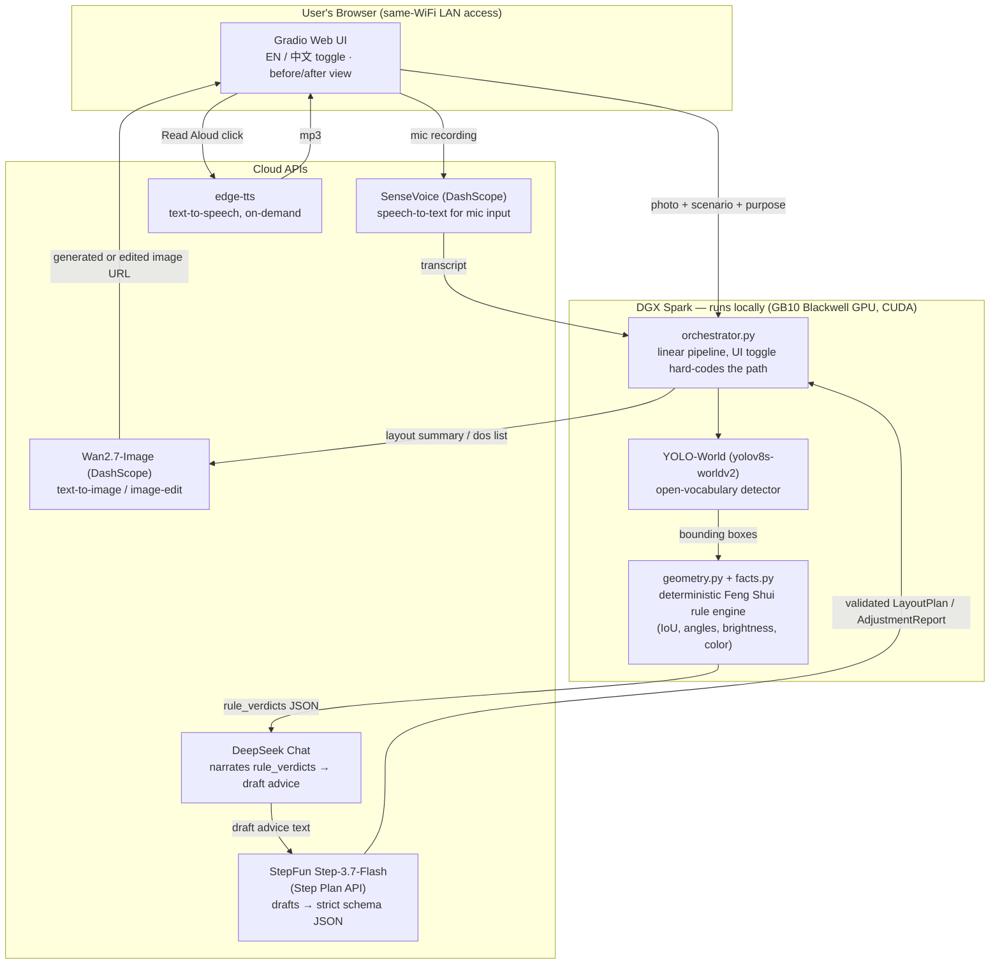

# AI Interior Feng Shui Consultant

[中文版](README.zh-CN.md)

Built for the **NVIDIA DGX Spark Hackathon**. A bilingual (English/中文) Gradio web app that takes
a room photo and, depending on scenario, returns a Feng-Shui-guided furniture layout for an
empty/raw space, or an annotated adjustment checklist with an edited "after" image for a
furnished space — grounded in a deterministic geometry engine, not LLM guesswork. See
`Claude.md` for the original spec this project was built against.

## Highlights

- **Deterministic-first, LLM-second.** The 10 Feng Shui rules (`rules/rule_base.json`) are
  evaluated by pure Python geometry (IoU, angle-between-centers, brightness, color histograms) —
  not by asking an LLM to eyeball coordinates. LLMs only ever narrate verdicts Python already
  computed, which keeps hallucinated geometry out of the loop entirely.
- **Open-vocabulary perception without fine-tuning.** Stock COCO-pretrained detectors don't have
  `door`/`window`/`mirror` classes, and fine-tuning a custom detector wasn't feasible in a sprint.
  YOLO-World's free-text class prompting solves this with zero training data, running on the DGX
  Spark's Blackwell GPU.
- **Real, working multi-agent-style pipeline**, not a single monolithic prompt: a "leader" model
  (DeepSeek) narrates facts into draft advice, a second model (StepFun Step-3.7-Flash) reformats
  that draft into schema-strict JSON, and a third model (Wan2.7-Image) turns the JSON into a
  generated or edited photo — each stage single-purpose and independently swappable/testable.
- **Bilingual end to end**, not just UI chrome: switching the language toggle changes the actual
  LLM-generated advice language (verified with real Chinese Feng Shui terminology output, not
  machine-translated afterward) and the TTS voice used for the read-aloud feature.
- **Honest engineering under real constraints.** This project's technical story includes a genuine
  local-deployment attempt for Step-3.7-Flash that hit real, measured hardware/network limits —
  documented below rather than glossed over, because that engineering judgment call is itself
  part of the submission's technical content.

## Architecture



Only detection (YOLO-World) and the rule engine run as local GPU/CPU compute on the DGX Spark;
every generative model call is a cloud API — see **Deployment & Model Optimization** below for
why, with real numbers.

## Technology Stack / Models Used

| Model | Role | Provider | Where it runs | Notes |
| --- | --- | --- | --- | --- |
| YOLO-World (`yolov8s-worldv2.pt`) | Open-vocabulary object detection — door/window/mirror/beam/furniture | Ultralytics (CLIP-based text encoder) | **Local — DGX Spark GPU (CUDA, Blackwell GB10)** | Zero-shot text-prompted classes; no fine-tuning |
| Step-3.7-Flash | Draft &rarr; strict schema JSON formatting | **StepFun (阶跃星辰)** | Cloud — Step Plan API | 198B-param sparse-MoE reasoning model; see optimization notes below for the local-serving attempt |
| DeepSeek-Chat | Facts &rarr; draft advice narration ("leader") | DeepSeek | Cloud — DeepSeek API | OpenAI-compatible endpoint |
| Wan2.7-Image | Text-to-image (Scenario A) / image editing (Scenario B) | Alibaba Cloud Model Studio (DashScope) | Cloud | |
| SenseVoice-v1 | Speech-to-text for the mic-input purpose field | Alibaba Cloud Model Studio (DashScope) | Cloud | |
| edge-tts (`en-US-AriaNeural`, `zh-CN-XiaoxiaoNeural`) | On-demand text-to-speech for the "Read Aloud" button | Microsoft Edge TTS | Local orchestration, remote synthesis | Free, no API key required |

**NVIDIA platform components used**: CUDA 13.0 Toolkit, PyTorch 2.13 (`cu130` build) with
`torch.cuda` backend, running on the DGX Spark's GB10 Grace-Blackwell superchip (`sm_121a`
architecture) for all local detection inference.

## Deployment & Model Optimization

**What actually runs locally on the DGX Spark**: YOLO-World's detection and text-encoding
(CLIP) forward passes, pinned explicitly to the CUDA device (`torch.cuda.is_available()` is
`True` on this hardware) — this was a real bug caught during testing: `set_classes()`'s text
encoder silently defaulted to CPU while `.predict()` ran on CUDA, crashing with a
device-mismatch error until both were pinned to the same device. The deterministic geometry rule
engine runs on CPU alongside it. Together these form the perception stage that grounds every
downstream LLM call in real, computed facts rather than model-guessed coordinates.

**The local Step-3.7-Flash attempt, and why it moved to the cloud**: this project initially
targeted fully local serving of StepFun's Step-3.7-Flash (a 198B-parameter sparse
mixture-of-experts model, ~11B active parameters/token) via `llama.cpp`, since the DGX Spark's
128GB unified memory is explicitly marketed for exactly this class of model. Quantization
analysis against measured GGUF shard sizes showed the "obvious" 4-bit quants (Q4_0 ≈113.6GB,
Q4_K_S ≈117.1GB, Q4_K_M ≈121.6–124.8GB) simply do not fit in this machine's RAM even with the
desktop GUI stopped (~103GB free headless) — a hard arithmetic constraint, not a soft
performance tradeoff. Q3_K_M (91.8GB) was selected as the largest quant with genuine headroom
left for YOLO-World, Gradio, and OS overhead. `llama.cpp` was successfully built from StepFun's
CUDA-enabled fork for the Blackwell architecture and confirmed working. The blocker turned out to
be network, not compute or memory: sustained download throughput on this environment measured
~5–8MB/s, making even the smallest workable quant a multi-hour download — incompatible with a
time-boxed hackathon sprint. Given that StepFun's own cloud "Step Plan" API serves the identical
model, the pragmatic call was to keep the local build/quantization work as documented engineering
(and keep the option to swap back in `api_clients/step_client.py` if network conditions differ),
while using the cloud endpoint for the actual submission.

**Model-serving optimizations applied in practice**:
- **Reasoning-model token budgeting**: Step-3.7-Flash is a reasoning model that emits a separate
  internal `reasoning` field before final `content`. An under-provisioned `max_tokens` (800) was
  found, via direct testing, to truncate mid-reasoning and return an *empty* `content` field
  with `finish_reason: "length"` — a silent failure mode, not an exception. Fixed by raising
  `max_tokens` to 4096 and setting `reasoning_effort: "low"` (this is a formatting-only call, not
  an analysis call, so minimal reasoning budget is appropriate).
- **Client-side hard timeouts**: DashScope's SDK-level `timeout` parameter was measured to be
  silently ignored for `MultiModalConversation.call()` (observed hangs of ~300 seconds despite
  passing `timeout=30`). `api_clients/wan_client.py` now wraps every call in a
  `ThreadPoolExecutor` with a real 45-second client-side deadline, so a stuck upstream call can
  never block a live demo request indefinitely.
- **Prompt-level task narrowing**: Step's system prompt explicitly instructs it to reformat, not
  re-derive, geometry — narrowing a general-purpose reasoning model down to a formatting-only
  role reduces both latency variance and hallucination surface.
- **Instruction-driven image edits, not diagnosis-driven ones**: Wan2.7-Image's edit instruction
  is built from the *actionable* "Do" list, not the *diagnostic* issue explanation — an earlier
  version passed the diagnosis text and produced visually unchanged images because there was
  nothing concrete to act on; switching to the actionable text produced genuinely different,
  targeted edits (verified against real furnished-room photos).
- **Compute-bounded perception**: images are resized to 640×640 before detection, and an
  area-based filter drops YOLO-World boxes covering more than 60% of the frame (a cheap guard
  against e.g. curtains being misread as a full wall, which would otherwise skew the geometric
  rule checks downstream).

## Setup

```bash
uv sync
cp .env.example .env   # fill in DEEPSEEK_API_KEY, DASHSCOPE_API_KEY, and STEP_API_KEY
```

### Run

```bash
./one-click-start.sh   # launches the Gradio app on 0.0.0.0:7860 (LAN-accessible)
```

## Smoke testing

Test each stage independently before relying on the full pipeline:

```bash
uv run python scripts/smoke_test.py --mode perception fixtures/raw_room.jpg
uv run python scripts/smoke_test.py --mode step
uv run python scripts/smoke_test.py --mode deepseek
uv run python scripts/smoke_test.py --mode wan
uv run python scripts/smoke_test.py --mode audio
uv run python scripts/smoke_test.py --mode e2e-a fixtures/raw_room.jpg "master bedroom"
uv run python scripts/smoke_test.py --mode e2e-b fixtures/furnished_bedroom_0.jpg
```

All six fixture photos (`fixtures/*.jpg`) have been run end to end through both scenarios against
the live cloud APIs — not just unit-tested in isolation.

## Known limitations

- **Latency**: two sequential LLM calls (DeepSeek narration, then Step formatting) plus a Wan
  image generation call means end-to-end timing (measured ~20–35s across real test runs) exceeds
  the original spec's 10s target. `orchestrator.py` logs per-stage timing so slow stages are
  visible rather than discovered live during a demo.
- **Mirror-facing detection** (`mirror_facing_bed_or_door` rule) uses 2D bbox IoU as a proxy for
  "facing" — no depth/pose estimation. It will miss same-2D-non-overlapping-but-actually-facing
  cases and can occasionally false-positive.
- **Beam detection** via the horizontal-dark-band heuristic is noisy on real photos (shadows,
  light fixtures, and crown molding can all look like dark horizontal bands) — treat it as
  advisory, lower-confidence output.
- **Photography assumption**: the door/window-angle and wealth-corner heuristics assume roughly
  frontal, room-spanning photography; angled/fisheye phone shots will degrade accuracy.
- **YOLO-World bounding-box looseness**: zero-shot detection boxes are sometimes noticeably
  larger than the actual object (observed on a real bed detection spanning ~50% of the frame) —
  a known accuracy/generality tradeoff of open-vocabulary detection versus a fine-tuned model.
- **`SEND_IMAGE_TO_LLM`** defaults to `false` — the Python-computed `rule_verdicts` are already
  the authoritative grounding, and sending the raw photo to the VLM adds vision-token prefill
  cost that directly fights the latency budget.

## Acknowledgments

With thanks to **NVIDIA**, **赞奇科技 (XSUPERZONE)**, and **StepFun** for the DGX Spark hardware,
hackathon platform, and model access that made this project possible.

— Team **Visioneer** ("different vision, united, we are one")
