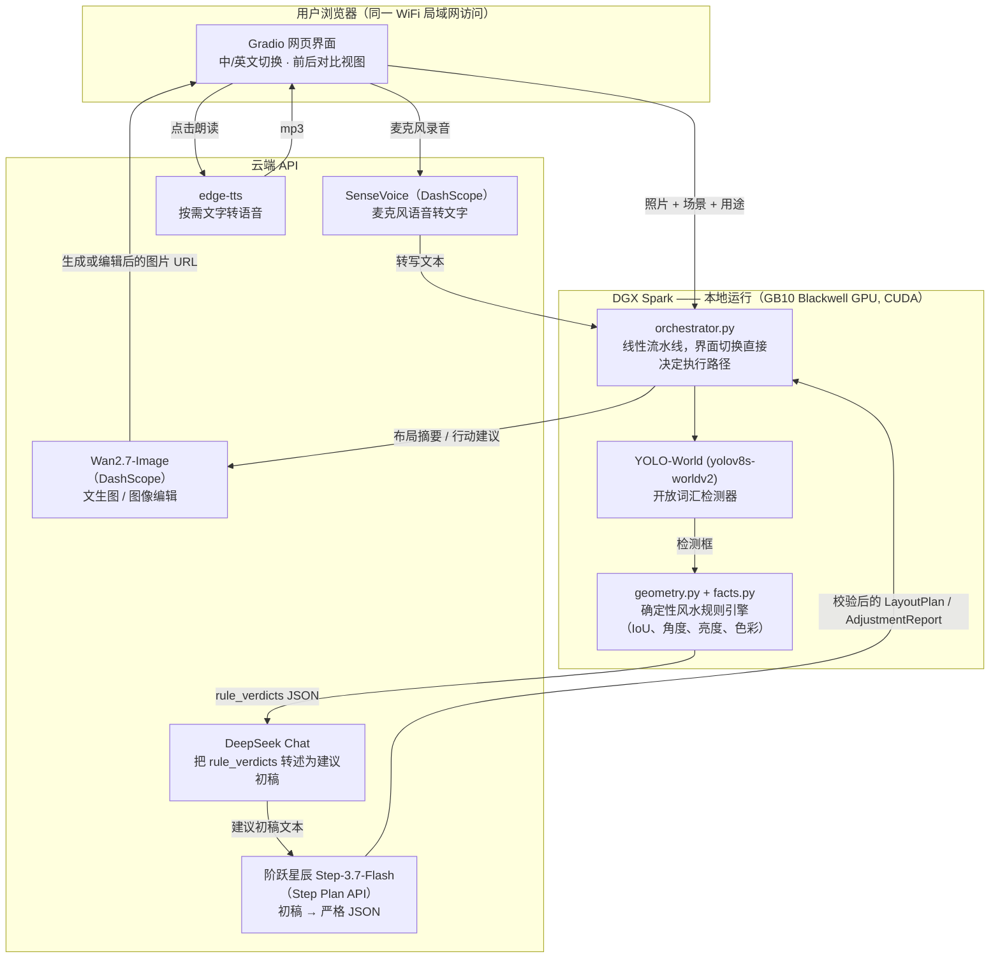

# AI 室内风水顾问

[English](README.md)

本项目为 **NVIDIA DGX Spark 黑客松**参赛作品。一个中英双语的 Gradio 网页应用：上传一张房间照
片，根据场景不同，为毛坯/未装修空间输出风水指导的家具布局方案，或为已装修空间输出带标注的调
整清单，并附带一张编辑后的"效果图"——所有判断都建立在确定性的几何计算引擎之上，而不是让大模
型凭感觉猜测空间关系。原始需求文档见 `Claude.md`。

## 项目亮点

- **确定性计算优先，大模型其次。** `rules/rule_base.json` 中的 10 条风水规则由纯 Python 几何
  计算完成判定（IoU 交并比、中心点连线角度、亮度、色彩直方图），而不是让大模型自己去"目测"坐标
  关系。大模型只负责把 Python 已经算好的判定结果转述成人话，从根本上杜绝了几何层面的幻觉问题。
- **无需微调的开放词汇感知。** 标准 COCO 预训练检测器里根本没有"门""窗""镜子"这几个类别，而在
  冲刺时间内微调一个自定义检测器也不现实。YOLO-World 的自由文本类别提示能力在零训练数据的情况
  下解决了这个问题，并且在 DGX Spark 的 Blackwell GPU 上本地运行。
- **真正跑通的多智能体式流水线**，而不是单一超长 Prompt：一个"领队"模型（DeepSeek）把事实数据
  转述成初稿建议，第二个模型（阶跃星辰 Step-3.7-Flash）把初稿重新格式化为严格符合 schema 的
  JSON，第三个模型（Wan2.7-Image）再把 JSON 变成生成或编辑后的图片——每个环节职责单一，可以独
  立替换、独立测试。
- **端到端的双语支持**，而不只是界面文字翻译：切换语言开关会真正改变大模型生成的建议内容的语言
  （已用真实的中文风水术语输出验证过，不是事后机器翻译），也会同步切换"朗读"功能使用的语音。
- **在真实约束下的诚实工程记录。** 本项目确实尝试过在本地部署 Step-3.7-Flash，也确实遇到了真实
  的、可测量的硬件与网络限制——下文如实记录了这段过程，而不是回避不谈，因为这个工程判断本身也
  是本次提交内容的一部分。

## 架构图



只有检测（YOLO-World）和规则引擎是在 DGX Spark 本地以 GPU/CPU 算力运行的；每一次生成式模型调
用都是云端 API——具体原因和真实数据见下方"部署方式与模型优化"章节。

## 技术栈 / 使用的模型

| 模型 | 作用 | 提供方 | 运行位置 | 说明 |
| --- | --- | --- | --- | --- |
| YOLO-World（`yolov8s-worldv2.pt`） | 开放词汇物体检测——门/窗/镜子/横梁/家具 | Ultralytics（基于 CLIP 文本编码器） | **本地——DGX Spark GPU（CUDA，Blackwell GB10）** | 零样本文本提示类别，无需微调 |
| Step-3.7-Flash | 初稿 → 严格 schema JSON 格式化 | **阶跃星辰（StepFun）** | 云端——Step Plan API | 1980 亿参数稀疏 MoE 推理模型；本地部署尝试详见下方优化说明 |
| DeepSeek-Chat | 事实数据 → 建议初稿转述（"领队"角色） | DeepSeek | 云端——DeepSeek API | OpenAI 兼容接口 |
| Wan2.7-Image | 文生图（场景 A）/ 图像编辑（场景 B） | 阿里云百炼（DashScope） | 云端 | |
| SenseVoice-v1 | 麦克风输入用途字段的语音转文字 | 阿里云百炼（DashScope） | 云端 | |
| edge-tts（`en-US-AriaNeural`、`zh-CN-XiaoxiaoNeural`） | "朗读"按钮的按需文字转语音 | 微软 Edge TTS | 本地编排、远程合成 | 免费，无需 API key |

**使用的 NVIDIA 平台组件**：CUDA 13.0 Toolkit、PyTorch 2.13（`cu130` 构建版本）及其
`torch.cuda` 后端，运行于 DGX Spark 的 GB10 Grace-Blackwell 超级芯片（`sm_121a` 架构）之上，
承担全部本地检测推理任务。

## 部署方式与模型优化

**真正在 DGX Spark 本地运行的部分**：YOLO-World 的检测与文本编码（CLIP）前向计算，二者都被显
式绑定到 CUDA 设备上（该硬件上 `torch.cuda.is_available()` 返回 `True`）——这里其实修复过一个
真实的 bug：`set_classes()` 的文本编码器默认会落在 CPU 上，而 `.predict()` 却在 CUDA 上运行，
不显式统一设备就会直接崩溃报错"张量不在同一设备"。确定性的几何规则引擎则与之并行运行在 CPU
上。二者共同构成了感知阶段，为后续每一次大模型调用提供的都是真实计算出的事实依据，而不是模型
臆测的坐标。

**本地部署 Step-3.7-Flash 的尝试，以及为何最终转向云端**：项目最初的目标是通过 `llama.cpp` 在
本地完整部署阶跃星辰的 Step-3.7-Flash（一个 1980 亿参数的稀疏混合专家模型，每 token 激活约
110 亿参数），因为 DGX Spark 128GB 的统一内存本身就是为这类模型量身宣传的。基于实测的 GGUF
分片体积做量化方案分析后发现，"理所当然"的 4-bit 量化版本（Q4_0 约 113.6GB、Q4_K_S 约
117.1GB、Q4_K_M 约 121.6–124.8GB）即便在关闭桌面图形界面、释放出约 103GB 可用内存的情况下，
依然装不进这台机器的物理内存——这是一个硬性的算术约束，而不是可以权衡的性能取舍。最终选定
Q3_K_M（91.8GB）作为在为 YOLO-World、Gradio 和操作系统预留真实余量的前提下，能用的最大量化版
本。`llama.cpp` 也已成功地从阶跃星辰针对 Blackwell 架构的 CUDA 加速分支构建完成并验证可运行。
真正的瓶颈其实并非算力或内存，而是网络：这台设备在实测环境下的持续下载带宽约为 5–8MB/s，即便
是体积最小的可用量化版本，下载也需要数小时——这与限时冲刺的黑客松节奏完全不兼容。考虑到阶跃星
辰官方云端 "Step Plan" API 提供的正是同一个模型，最终的务实决策是：把本地构建与量化选型的工程
工作作为文档记录保留下来（并保留了随时在 `api_clients/step_client.py` 中切回本地部署的接口设
计），而在正式提交版本中使用云端接口完成实际功能。

**实践中应用的模型调用优化**：

- **推理模型的 Token 预算调优**：Step-3.7-Flash 是一个推理模型，会在给出最终 `content` 之前，
  先在一个独立的 `reasoning` 字段里"打草稿"。实测发现，`max_tokens` 设置过低（800）会导致模型
  在推理过程中被截断，返回一个*空的* `content` 字段，同时 `finish_reason` 显示为
  `"length"`——这是一种静默失败，而不是抛出异常。修复方式是将 `max_tokens` 提升到 4096，并设置
  `reasoning_effort: "low"`（因为这一步只是格式化任务而非分析任务，用较低的推理预算即可）。
- **客户端硬超时**：实测发现 DashScope SDK 自带的 `timeout` 参数在
  `MultiModalConversation.call()` 调用中并不生效（即便传入 `timeout=30`，仍观察到约 300 秒的
  静默挂起）。`api_clients/wan_client.py` 现在用 `ThreadPoolExecutor` 包装每一次调用，加上真正
  生效的 45 秒客户端侧硬性超时，确保上游卡死的请求永远不会无限期阻塞一次真实的用户请求。
- **Prompt 层面的任务收窄**：Step 的系统提示词明确要求它"重新格式化"而非"重新推导"几何关系——
  把一个通用推理模型限定为纯格式化角色，既降低了延迟波动，也缩小了产生幻觉的空间。
- **用"行动指令"而非"问题诊断"驱动图像编辑**：Wan2.7-Image 的编辑指令构建自*可执行*的"宜"清
  单，而不是*诊断性*的问题说明文字——早期版本传入的是诊断文字，结果生成的图片几乎没有变化，因
  为模型没有可以具体执行的动作；改为传入行动指令后，在真实的已装修房间照片上验证出了确实有针对
  性的视觉改动。
- **感知阶段的算力边界控制**：图片在送入检测器前统一缩放到 640×640；同时用一个基于面积占比的
  过滤器丢弃覆盖画面超过 60% 的 YOLO-World 检测框（一个低成本的防护措施，避免例如窗帘被误判为
  整面墙，从而扰乱下游的几何规则判定）。

## 环境搭建

```bash
uv sync
cp .env.example .env   # 填入 DEEPSEEK_API_KEY、DASHSCOPE_API_KEY 和 STEP_API_KEY
```

### 运行

```bash
./one-click-start.sh   # 在 0.0.0.0:7860 启动 Gradio 应用（局域网内可访问）
```

## 冒烟测试

在依赖完整流水线之前，先独立测试每个环节：

```bash
uv run python scripts/smoke_test.py --mode perception fixtures/raw_room.jpg
uv run python scripts/smoke_test.py --mode step
uv run python scripts/smoke_test.py --mode deepseek
uv run python scripts/smoke_test.py --mode wan
uv run python scripts/smoke_test.py --mode audio
uv run python scripts/smoke_test.py --mode e2e-a fixtures/raw_room.jpg "master bedroom"
uv run python scripts/smoke_test.py --mode e2e-b fixtures/furnished_bedroom_0.jpg
```

六张真实测试照片（`fixtures/*.jpg`）均已在两个场景下、针对真实云端 API 完整跑通端到端流程，而
不只是孤立的单元测试。

## 已知局限

- **延迟**：两次串行大模型调用（DeepSeek 转述 + Step 格式化）加上一次 Wan 图像生成调用，实测端
  到端耗时约 20–35 秒，超过了需求文档中原定的 10 秒目标。`orchestrator.py` 会记录每个阶段的耗
  时，便于提前发现慢环节，而不是在演示现场才发现。
- **镜子朝向检测**（`mirror_facing_bed_or_door` 规则）用 2D 包围盒 IoU 作为"朝向"的代理指标——
  没有深度/姿态估计。可能漏掉"2D 不重叠但实际朝向对着"的情况，偶尔也会误报。
- **横梁检测**：基于水平暗色条带的启发式方法在真实照片上噪声较大（阴影、灯具、石膏线都可能被误
  判为水平暗带）——建议作为参考性、低置信度的输出对待。
- **拍摄假设**：门窗夹角与财位亮度的启发式算法假设照片是较为正面、能覆盖多面墙的取景；斜角/广
  角手机照片会降低准确度。
- **YOLO-World 检测框偏松**：零样本检测的包围盒有时会明显大于实际物体（实测中一次床铺检测的框
  覆盖了约 50% 的画面）——这是开放词汇检测相对于微调模型在准确度与泛化能力之间的一个已知取舍。
- **`SEND_IMAGE_TO_LLM`** 默认关闭——Python 计算出的 `rule_verdicts` 已经是权威依据，把原始照
  片发给 VLM 会增加视觉 token 的预填充开销，直接挤压延迟预算。

## 致谢

感谢 **NVIDIA**、**赞奇科技（XSUPERZONE）** 与 **StepFun（阶跃星辰）** 提供的 DGX Spark 硬件、
黑客松平台与模型支持，使本项目得以实现。

—— Visioneer 团队（"Different vision united, we are one." / 视角各异，同心同行）
